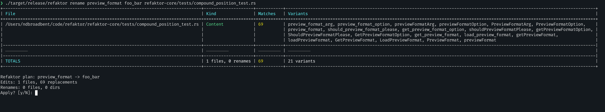
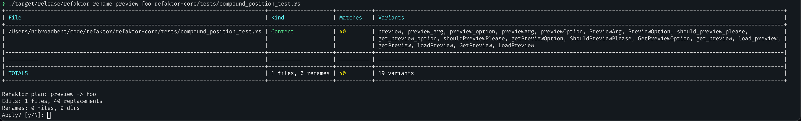
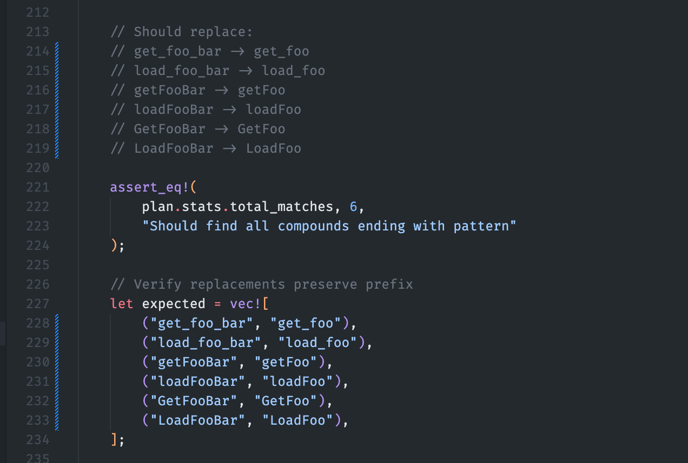

This case study demonstrates using Refaktor to rename a command-line argument across an entire codebase, 
including documentation, tests, and code. 

## Background

The initial code for the Refaktor CLI had an inconsistency in its argument naming:

- The `rename` command used `--preview` to choose the preview format
- The `plan` command used `--preview-format` for the same purpose

I wanted to standardize on `--preview` by renaming the `--preview-format` argument in the `plan` command to match `rename`.

This refactoring involved:
- Updating the CLI argument definition in the Rust code
- Renaming test examples that use `preview_format` in compound matching tests
- Updating this documentation site (in `./docs`)

## Step 1: Renaming Test Examples

First, I needed to update the test cases in `compound_matcher.rs` and `compound_position_test.rs` that 
used `preview_format` strings as test data. (I had written extra tests during the initial attempt at this rename!)
These tests verified compound word matching functionality and used:

```rust
find_compound_variants(
    "shouldPreviewFormatPlease",
    "preview_format", 
    "preview",
    &styles,
);
```

I needed to change the test examples to use a different compound word that won't conflict with our argument rename.
I decided to rename "preview_format" to "foo_bar" and "preview" to "foo".

```bash
./target/release/refaktor rename preview_format foo_bar \
    refaktor-core/tests/compound_position_test.rs
```



This one command replaced all of these variants in one shot, and all converted to the right case:

```
preview_format_arg, preview_format_option, previewFormatArg, 
previewFormatOption, PreviewFormatArg, PreviewFormatOption, 
preview_format, should_preview_format_please, get_preview_format_option, 
shouldPreviewFormatPlease, getPreviewFormatOption, ShouldPreviewFormatPlease, 
GetPreviewFormatOption, get_preview_format, load_preview_format, 
getPreviewFormat, loadPreviewFormat, GetPreviewFormat, LoadPreviewFormat, 
PreviewFormat, previewFormat 
```

Then a `preview` => `foo` rename to handle the remaining cases:

```bash
./target/release/refaktor rename preview foo \
    refaktor-core/tests/compound_position_test.rs
```




Here's the result:



I ran the tests and they all passed.

## Step 2: Renaming the CLI Argument

Now I was able to rename the CLI argument with worrying about these test cases.

```bash
./target/release/refaktor rename preview_format foo_bar \
    refaktor-core/src/cli.rs
```
