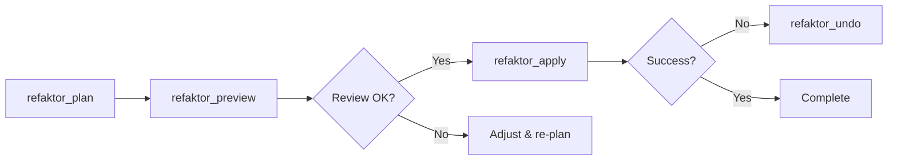

import { Card, CardGrid, Code } from '@astrojs/starlight/components';

The Refaktor MCP Server provides 7 specialized tools for AI agents to perform intelligent refactoring operations.

## refaktor_plan

Creates a comprehensive refactoring plan that identifies all case variations of your identifiers.

### Parameters

| Parameter | Type | Required | Default | Description |
|-----------|------|----------|---------|-------------|
| `old` | string | ✅ Yes | - | The identifier to replace |
| `new` | string | ✅ Yes | - | The new identifier |
| `includes` | string[] | No | All files | Glob patterns to include |
| `excludes` | string[] | No | None | Glob patterns to exclude |
| `styles` | string[] | No | All styles | Case styles to detect |
| `previewFormat` | string | No | `summary` | Output format |
| `dryRun` | boolean | No | `false` | Preview without saving |
| `renameFiles` | boolean | No | `true` | Rename matching files |
| `renameDirs` | boolean | No | `true` | Rename matching directories |

### Case Styles

Available case style options:
- `snake` - snake_case
- `camel` - camelCase
- `pascal` - PascalCase
- `kebab` - kebab-case
- `screaming` - SCREAMING_SNAKE_CASE
- `title` - Title Case
- `train` - Train-Case
- `dot` - dot.case

### Preview Formats

- `summary` - AI-optimized concise format
- `table` - Human-readable table
- `diff` - Unified diff format
- `json` - Full structured data

### Example Usage

```
Tool: refaktor_plan
Arguments: {
  "old": "UserAccount",
  "new": "CustomerAccount",
  "includes": ["src/**/*.ts", "tests/**/*.ts"],
  "excludes": ["node_modules/**", "dist/**"],
  "styles": ["camel", "pascal", "snake"],
  "previewFormat": "summary",
  "dryRun": false
}
```

### Response Example

```
Created plan: a3b7c9d4e8f2a6b1

Summary:
  Files to modify: 12
  Total replacements: 47
  Variants found:
    UserAccount (15)
    userAccount (18)
    user_account (8)
    USER_ACCOUNT (6)
  Files to rename: 3
    src/UserAccount.ts → src/CustomerAccount.ts
    tests/userAccount.test.ts → tests/customerAccount.test.ts
    docs/user-account.md → docs/customer-account.md
```

## refaktor_apply

Applies a refactoring plan to make the actual changes to your codebase.

### Parameters

| Parameter | Type | Required | Default | Description |
|-----------|------|----------|---------|-------------|
| `planId` | string | No | Latest | Specific plan ID to apply |
| `planPath` | string | No | Auto | Path to plan file |
| `atomic` | boolean | No | `true` | All-or-nothing execution |
| `commit` | boolean | No | `false` | Create git commit after |

### Example Usage

```
Tool: refaktor_apply
Arguments: {
  "atomic": true,
  "commit": true
}
```

### Response Example

```
Successfully applied plan a3b7c9d4e8f2a6b1
  ✓ Modified 12 files
  ✓ Applied 47 replacements
  ✓ Renamed 3 files
  ✓ Created git commit: "refactor: rename UserAccount to CustomerAccount"

All changes applied successfully.
```

### Error Handling

If conflicts are detected:
```
Error: Conflicts detected in 2 files:
  - src/api/handlers.ts: Content changed since plan creation
  - lib/database.ts: File no longer exists

Run 'refaktor_plan' again to create a fresh plan with current file state.
```

## refaktor_undo

Reverts a previously applied refactoring operation.

### Parameters

| Parameter | Type | Required | Default | Description |
|-----------|------|----------|---------|-------------|
| `id` | string | ✅ Yes | - | History ID to undo |

### Example Usage

```
Tool: refaktor_undo
Arguments: {
  "id": "a3b7c9d4e8f2a6b1"
}
```

### Response Example

```
Successfully undone refactoring a3b7c9d4e8f2a6b1
  ✓ Reverted 47 replacements in 12 files
  ✓ Restored 3 renamed files
  
All changes have been reverted.
```

## refaktor_redo

Re-applies a previously undone refactoring.

### Parameters

| Parameter | Type | Required | Default | Description |
|-----------|------|----------|---------|-------------|
| `id` | string | ✅ Yes | - | History ID to redo |

### Example Usage

```
Tool: refaktor_redo
Arguments: {
  "id": "a3b7c9d4e8f2a6b1"
}
```

### Response Example

```
Successfully redone refactoring a3b7c9d4e8f2a6b1
  ✓ Re-applied 47 replacements in 12 files
  ✓ Re-renamed 3 files
  
All changes have been re-applied.
```

## refaktor_history

Shows the history of refactoring operations.

### Parameters

| Parameter | Type | Required | Default | Description |
|-----------|------|----------|---------|-------------|
| `limit` | number | No | `10` | Number of entries to show |

### Example Usage

```
Tool: refaktor_history
Arguments: {
  "limit": 5
}
```

### Response Example

```
Refactoring History (last 5 operations):

1. 4e8f2a6b1d3c7a9b [APPLIED]
   getUserData → fetchUserData
   12 files, 38 replacements
   Applied: 1734567890

2. a3b7c9d4e8f2a6b1 [UNDONE]
   UserAccount → CustomerAccount
   12 files, 47 replacements
   Applied: 1734567800
   Undone: 1734567900

3. 6b1d3a7c9e4f8a2b [APPLIED]
   snake_case → camelCase (config migration)
   8 files, 156 replacements
   Applied: 1734567600
```

## refaktor_status

Shows the current status of Refaktor, including pending plans and system state.

### Parameters

This tool takes no parameters.

### Example Usage

```
Tool: refaktor_status
Arguments: {}
```

### Response Example

```
Refaktor Status:

Current Directory: /home/user/project
Git Branch: feature/refactoring
Git Status: Clean (no uncommitted changes)

Pending Plans:
  1d3a7c9e4f8b2a6c - oldFunction → newFunction
    Created: 5 minutes ago
    Status: Not applied
    Files: 8, Replacements: 23

Last Applied:
  4e8f2a6b1d3c7a9b - getUserData → fetchUserData
    Applied: 1 hour ago
    Status: Success

System:
  Refaktor Version: 1.2.0
  Config: .refaktor/config.json found
  History Entries: 47
```

## refaktor_preview

Preview a plan in different formats without applying changes.

### Parameters

| Parameter | Type | Required | Default | Description |
|-----------|------|----------|---------|-------------|
| `planId` | string | No | Latest | Plan ID to preview |
| `planPath` | string | No | Auto | Path to plan file |
| `format` | string | No | `summary` | Preview format |

### Format Options

- `summary` - Concise AI-friendly format
- `table` - Detailed table view
- `diff` - Unified diff format
- `json` - Raw JSON data

### Example Usage

```
Tool: refaktor_preview
Arguments: {
  "format": "diff"
}
```

### Response Example (diff format)

```diff
--- a/src/components/UserAccount.tsx
+++ b/src/components/CustomerAccount.tsx
@@ -1,8 +1,8 @@
-import { UserAccount } from '../types';
+import { CustomerAccount } from '../types';

-interface UserAccountProps {
-  account: UserAccount;
+interface CustomerAccountProps {
+  account: CustomerAccount;
 }

-export function UserAccountComponent({ account }: UserAccountProps) {
+export function CustomerAccountComponent({ account }: CustomerAccountProps) {
```

## Tool Interaction Patterns

### Safe Refactoring Workflow



### Best Practices for AI Agents

1. **Always plan before applying**
   - Use `refaktor_plan` first
   - Review with `refaktor_preview` if needed
   - Only then use `refaktor_apply`

2. **Use specific includes when possible**
   - Target specific directories: `["src/**/*.ts"]`
   - Exclude test files if not needed: `["!**/*.test.ts"]`

3. **Check status before operations**
   - Use `refaktor_status` to verify clean state
   - Ensure no pending uncommitted changes

4. **Handle errors gracefully**
   - Check for "conflicts detected" messages
   - Use `refaktor_undo` if something goes wrong
   - Re-plan if files have changed

## Error Messages and Recovery

### Common Error Patterns

| Error | Cause | Solution |
|-------|-------|----------|
| "Refaktor CLI not available" | Binary not in PATH | Check installation |
| "No matches found" | Pattern too restrictive | Broaden search criteria |
| "Conflicts detected" | Files changed since plan | Create new plan |
| "Plan not found" | Invalid plan ID | Check with `refaktor_history` |
| "Permission denied" | File permissions | Check file ownership |

### Recovery Strategies

**When apply fails:**
1. Note the error message
2. Use `refaktor_status` to check state
3. If partially applied, use `refaktor_undo`
4. Fix the issue and create a new plan

**When patterns don't match:**
1. Start with broader patterns
2. Use `dryRun: true` to test
3. Adjust styles array if needed
4. Check file extensions in includes

## Performance Considerations

### Large Codebases

For repositories with >10,000 files:
- Use specific `includes` patterns
- Exclude build/dist directories
- Consider breaking into multiple operations

### Memory Usage

The MCP Server loads plans into memory:
- Plans typically < 1MB for most refactorings
- Very large plans (>10MB) may need chunking
- Use `format: "summary"` for efficiency

## Next Steps

<CardGrid>
  <Card title="Usage Examples" icon="rocket" href="/refaktor/mcp/examples">
    See real-world refactoring scenarios
  </Card>
  <Card title="AI Agent Guide" icon="robot" href="/refaktor/mcp/ai-guide">
    Best practices for AI-assisted refactoring
  </Card>
</CardGrid>
