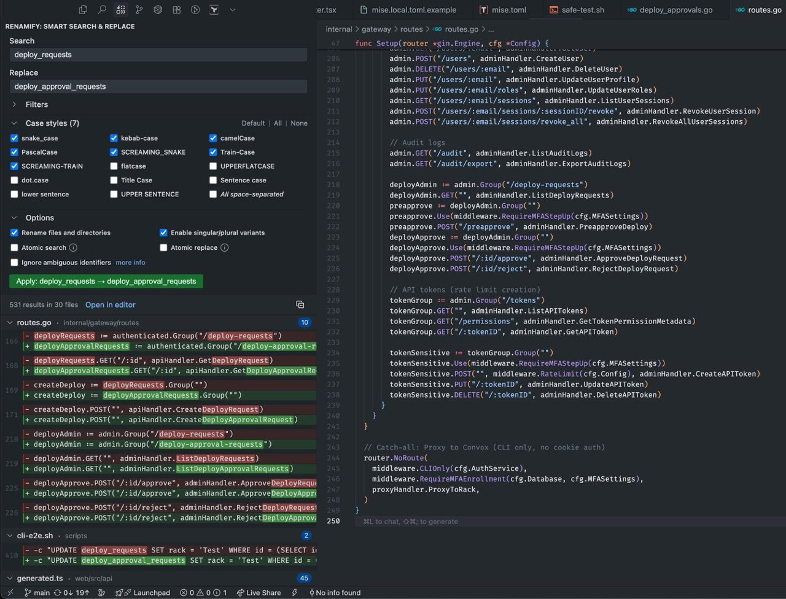

import { LinkCard, Card, CardGrid } from '@astrojs/starlight/components';

The Renamify VS Code extension brings case-aware search & replace directly into your editor with visual previews and interactive controls.



## Installation

### From VS Code Marketplace

1. Open VS Code
2. Go to Extensions (Ctrl+Shift+X / Cmd+Shift+X)
3. Search for "Renamify"
4. Click Install

### From Command Line

```bash
code --install-extension DocSpring.renamify
```

## How to Use

### Open the Renamify Panel

1. Click the Renamify icon in the Activity Bar (left sidebar)
2. Or use Command Palette: `Renamify: Open Search Panel`

### Search and Replace

1. Enter your search term (e.g., `getUserName`)
2. Enter replacement (e.g., `fetchUserProfile`)
3. Select case styles to include/exclude
4. Click "Search" to preview matches
5. Review the changes in the results panel
6. Click "Apply" to make the changes

### Undo Operations

Use the Command Palette to access undo and history commands:
- `Renamify: Undo Last Operation` - Undo the last rename operation
- `Renamify: Show History` - View operation history

## Configuration

Configure Renamify in VS Code settings:

- **`renamify.cliPath`** - Path to renamify CLI (auto-detected by default)
- **`renamify.respectGitignore`** - Honor .gitignore files (default: true)
- **`renamify.showContextLines`** - Number of context lines in results (default: 2)
- **`renamify.autoSaveBeforeApply`** - Auto-save files before applying (default: true)
- **`renamify.confirmBeforeApply`** - Show confirmation dialog (default: false)

## Compatibility

- Works in VS Code 1.85.0 and later
- Fully compatible with Cursor and other VS Code forks
- Requires renamify CLI to be installed

## Keyboard Shortcuts

No default keyboard shortcuts are set. You can configure your own:

1. Open Keyboard Shortcuts (Ctrl+K Ctrl+S / Cmd+K Cmd+S)
2. Search for "Renamify"
3. Add your preferred shortcuts

## Getting Help

<LinkCard
  title="Report Issues"
  href="https://github.com/DocSpring/renamify/issues"
  description="Report bugs or request features on GitHub"
/>
